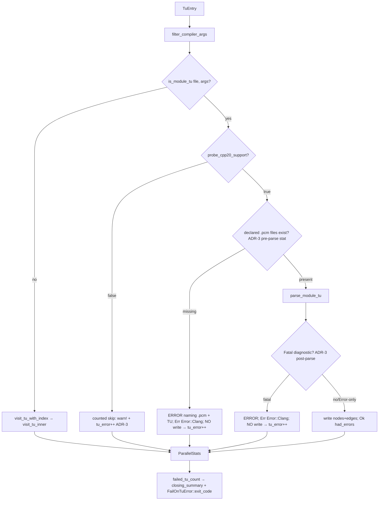

# PCM Support — Design

Task: `pcm-support` · Stage 3 (architect) · Charter: `.claude/handoff/pcm/CHARTER.md`
Upstream: `requirements.md`, `scenarios.md` · Downstream: senior-developer reads this + all `adr-*.md`
Source spec: [[pages/planning/cpp-indexer-compact-ingest-path]] § "Added requirement (2026-05-30): PCM support"

## 1. Problem & scope

Wire the already-written but unlinked C++20/PCM module parser (`src/visit/modules_cpp20.rs`)
into the parallel Phase-1 dispatch so that TUs consuming Clang precompiled modules
(`.pcm` / `-fmodules` / `-fmodule-file=` / `-fprebuilt-module-path`) are indexed correctly,
and — critically — so that **missing or invalid `.pcm` inputs produce a loud, counted failure
instead of a silent partial parse** (the Issue 0001 failure family).

PCM is CPU-bound, not RAM-bound: it does **not** advance the compact-ingest-path RSS/Parquet
goals. Treat it as an orthogonal parse-capability requirement.

**No graph schema change.** `MODULE` node and the additive `module_interface` attr already
exist (`src/visit/modules_cpp20.rs:271`). `schemaBump: false`. Adding a Rust struct field to
`ParallelStats` (if chosen for skip-counting, ADR-3) is an in-process counter, not a graph
schema v5/v6 change — the I2b gate is about the on-graph schema and is unaffected.

## 2. Current state (verified by reading source)

| Component | State | Evidence |
|---|---|---|
| `parse_module_tu()` | exists, parses `.cppm`, emits MODULE node + INCLUDES/CONTAINS | `modules_cpp20.rs:203` |
| `is_module_tu()` | exists; matches ext OR (`-fmodules` && `-std=c++20`) | `modules_cpp20.rs:168` |
| `probe_cpp20_support()` | exists; OnceLock-cached runtime probe | `modules_cpp20.rs:66` |
| `warn_and_skip()` | exists; logs `warn!` but **counts nothing** | `modules_cpp20.rs:157` |
| Dispatch site | `visit_tu_with_index()` always called; module path **not wired** | `parallel.rs:176` |
| PCM-flag passthrough | preserved by `sanitize_libclang_args` / `filter_compiler_args` | `compile_commands.rs:63`, `mod.rs:525` |
| Failure contract | `failed_tu_count` feeds BOTH `closing_summary()` AND `FailOnTuError::exit_code()` | `mod.rs:230,724`; `index.rs:64,301` |

## 3. The trap this task must close (lead finding)

The pre-existing `parse_module_tu()` is **itself an Issue-0001 trap** on bad `.pcm` input.
libclang's `parse()` almost never returns `Err` for a module-load failure — it returns
`Ok(tu)` carrying a **Fatal** diagnostic. Tracing the current code:

1. `parse()` → `Ok(tu)` (missing/corrupt `.pcm` does not produce a hard `Err`).
2. Line 245 lumps `Error | Fatal` together → `has_errors = true`.
3. Line 251 logs a `warn!`, then **writes the partial nodes** (lines 481–482).
4. Returns `Ok(true)` → `run_phase1_parallel` counts it as `tu_partial`, **not** `tu_error`.

Net: a partial graph is emitted for the broken TU, counted as *partial*, and the process
exits 0. That directly violates S3-AC1/AC2 ("no graph nodes or edges emitted for that TU")
and S2-AC4/S3-AC3 ("must be counted as failed / non-zero outcome").

**Reusing the failure contract is correct, but it must actually be fed.** The design routes
PCM load failures to `tu_error` → `failed_tu_count`, which satisfies *both* OR-branches at once.

## 4. Decisions (see ADRs)

- **ADR-1** — Dispatch point & routing (decision a): branch at `parallel.rs:176` on
  `is_module_tu()`; route to `parse_module_tu()` (capable) or counted skip (not capable);
  preserve the TU's original `-std` for PCM-*consuming* `.cpp` TUs.
- **ADR-2** — PCM detection in `is_module_tu()` (decision b): flag-presence, **independent of
  language standard**; add `-fmodule-file=` / `-fprebuilt-module-path` prefix matching and drop
  the `-std=c++20` co-requirement for the `-fmodules` flag.
- **ADR-3** — Loud-diagnostic strategy for missing/invalid `.pcm` (decision c) **and** the
  failure-signaling OR contract: pre-parse `stat` + post-parse Fatal-severity gate, both return
  `Err(Error::Clang)` *before any write*; failures land in `failed_tu_count`.

## 5. Dispatch flow (target)

The branch lives in `run_phase1_parallel` at the per-TU closure (`parallel.rs:163–179`), inside
the existing `catch_unwind`. The `match parse_result` arms (`parallel.rs:181–211`) already map
`Err(Error::Clang)` → `tu_error` and `Ok(true)` → `tu_partial`; no change there. The module path
must therefore return `Err(Error::Clang)` for load failures (so they count as errors) and
reserve `Ok(true)` strictly for genuine soft-`Error`-severity partials.

## 6. The probe is a proxy (honest limitation)

`probe_cpp20_support()` tests named-module-**interface** parsing (`ModuleImportDecl` presence),
**not** `.pcm` consumption. We reuse it as the coarse, process-wide capability gate (cheap,
already OnceLock-cached). Fine-grained per-TU `.pcm` failures are caught by the ADR-3 path, not
the probe. This is an explicit best-effort posture, documented in S5. It is acceptable because
the per-TU stat+Fatal gate is the real safety net; the probe only short-circuits the obviously
unsupported environment.

## 7. Failure-signaling OR contract — SETTLED (resolves scenarios open-question #3)

The scenarios leave "non-zero exit code OR machine-readable summary with `failed_tus > 0`"
undecided. **It is not a real disjunction in this codebase** — `failed_tu_count` already drives
both outputs (`mod.rs:230` → `closing_summary()` and `index.rs:301` → `exit_code()`). The
contract is therefore:

> **All PCM load failures (probe-absent skip, missing `.pcm`, Fatal `.pcm`) increment
> `failed_tu_count`. The machine-readable `failed N` summary is always emitted; the non-zero
> exit code fires per the operator's `--fail-on-tu-error` policy.**

Critical consequence for tests: `FailOnTuError::default()` is **`Ratio(1.0)`** (`index.rs:54`),
so exit code 2 fires only when *every* TU fails. For S4's mixed fixture (1 OK + 1 broken PCM),
`failed/total = 0.5 < 1.0` → **exit 0 by default**. The S4-AC2 test MUST therefore assert on
`failed_tu_count > 0` (the always-on summary branch) **or** pass `--fail-on-tu-error 0.0`. The
default-exit-0 behavior is correct and intentional (best-effort ratio policy); do not "fix" it.

## 8. Stories → mechanism

| Story | Mechanism | ADR |
|---|---|---|
| S1 detect | `is_module_tu()` flag-presence matching | ADR-2 |
| S1-AC4 probe | reuse `probe_cpp20_support()`; capable=false ⇒ counted skip | ADR-1, ADR-3 |
| S2 route | branch at `parallel.rs:176` | ADR-1 |
| S2-AC4 loud skip | `tu_error++` (not silent, not partial) | ADR-3 |
| S3 missing/invalid `.pcm` | pre-parse stat + post-parse Fatal gate → `Err` before write | ADR-3 |
| S4 integration test | follow `tests/integration/{symbol_id_integration,parallel_phase1,cli_fail_on_tu_error}.rs` patterns; `#[ignore]` when probe absent; assert `failed_tu_count > 0` | ADR-3 §tests |
| S5 docs | README: libclang 18+, supported flags, best-effort, loud-fail posture | — |

## 9. Hazards for the developer (must not regress)

- **Do NOT force `-std=c++20` on PCM-consuming `.cpp` TUs.** `parse_module_tu()` currently
  force-appends `-std=c++20` (`modules_cpp20.rs:215–217`). That is right for `.cppm`/`.ixx`/`.mxx`
  *interface* units but **wrong** for a C++17 `.cpp` that merely consumes a `.pcm` — it changes
  language semantics and can trigger spurious "module out of date" Fatals, breaking S2-AC3.
  Gate the force-append on a module-interface *extension*; for flag-only PCM consumers, preserve
  the TU's original `-std`. (ADR-1 §3.)
- **Split severity.** Replace the `Error | Fatal` lump (`modules_cpp20.rs:245–247`): `Fatal` ⇒
  suppress write + `Err`; `Error` ⇒ keep existing partial-write + `Ok(true)`. (ADR-3.)
- **`warn_and_skip` counts nothing today.** Wire the skip to `tu_error` (ADR-3).
- **`-fprebuilt-module-path` is a directory, not a file.** Pre-parse stat for that flag checks
  the directory exists; the actual `.pcm` filename is module-derived and may legitimately be
  resolved lazily by libclang — rely on the post-parse Fatal gate for that case. Only
  `-fmodule-file=name=path` gives an explicit file to stat. (ADR-3 §edge.)
- **Idempotent runtime probe.** `probe_cpp20_support()` is OnceLock-cached; safe to call per TU.

## 10. Out of scope (restated)
RSS / Parquet-size reduction; schema/backend redesign; system-header nodes; gRPC (M9+);
new edge kinds (ADR-8 scope-limit holds — module imports reuse `EdgeKind::Includes`).

## 11. Validation gates
- `cargo fmt --all`; `cargo clippy --all-targets --all-features -- -D warnings`.
- `cargo nextest run` (libclang env baked per dev-team lessons); `--ignored` for the
  probe-gated module test on a libclang-18+ host.
- No `.unwrap()`/`.expect()` in the new library paths (rust-conventions); use `?` + `Error::Clang`.
- Schema unchanged: confirm `prompt/graph_database/cpp/schema.txt` is untouched.
