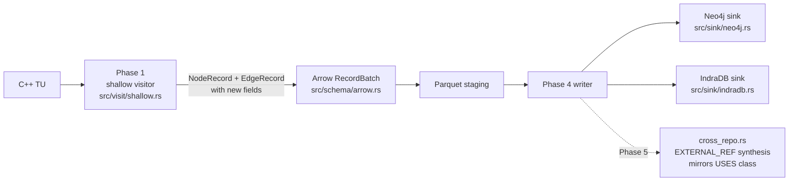

# M8 Design — Structured Node Attributes

## 1. Goal in one paragraph

Promote 10 node fields and 2 edge fields out of opaque `attrs_json` into native columns on every storage layer (`NodeRecord`/`EdgeRecord` → Arrow → Neo4j Bolt → IndraDB gRPC), add covering Neo4j indexes, and bump `SCHEMA_VERSION` to v5 with hard refusal on mismatch. No automatic migration; old graphs are wiped and re-indexed.

## 2. Decision summary

| # | Decision | ADR | Resolves |
|---|---|---|---|
| 1 | `SCHEMA_VERSION` bumps 4 → 5; full promotion of `is_virtual`/`is_pure_virtual`/`is_static` (no dual-write). | ADR-11 | OQ-1, AC-S40-1/5/6 |
| 2 | `code` stored inline on the node with a 32 KiB byte cap; `code_truncated: true` when oversize. | ADR-12 | OQ-2, AC-S41-5/6 |
| 3 | USES classifier = closed `enum AccessKind` of exactly 7 values; libclang parent-chain walk; EXTERNAL_REF mirrors classification in Phase 5. | ADR-13 | OQ-3, AC-S43-1..6 |
| 4 | `params`/`template_params`/`template_args` = typed `Vec<Struct>` in Rust; `List<Struct>` in Arrow; native `List<Map>` over Bolt; per-field `indradb::Json` property in IndraDB. | ADR-14 | AC-S40-2/4, AC-S42-2/3, AC-S44-1, AC-S45-1 |
| 5 | Neo4j: 4 new indexes (`return_type`, `is_virtual`, `is_static`, composite `(kind,return_type)`). IndraDB: 4 `index_property` registrations (no composite — v5 limit, documented). | ADR-15 | OQ-5, AC-S44-3/4 |

OQ-4 (Neo4j deadlock retry as S44 prerequisite) is **already implemented** at `src/sink/neo4j.rs:277` and `:720`. Not a blocker; no ADR needed. Confirm during S44 dev that the additional properties per row do not push retry rate beyond `MAX_TRANSIENT_RETRIES = 3`; flag as a sizing concern, not a design gap.

OQ in PRD §9 about `exception_spec` / `control_flow` promotion: **out of M8 scope** (requirements §Out-of-scope confirms); they remain in `attrs_json`.

## 3. Architecture

### 3.1 Data flow (unchanged at the high level; new fields ride existing path)



Three boundaries gain new code:
- **Visitor** (`src/visit/shallow.rs` + new `src/visit/access_classifier.rs`) — emit new fields.
- **Arrow** (`src/schema/arrow.rs`) — typed columns added; round-trip tests extended.
- **Sinks** (`src/sink/{neo4j,indradb}.rs`) — Cypher SET clauses extended; IndraDB property writes per ADR-14.

### 3.2 NodeRecord shape after S40

```rust
// src/schema/nodes.rs (additions; existing fields unchanged)
pub struct NodeRecord {
    // ... existing fields (usr, kind, name, qualified_name, mangled_name,
    //     file_path, line, col, repo_name, attrs_json, partial, phase, tu_hash) ...

    // M8 promotions (S40):
    pub return_type:     Option<String>,
    pub params:          Option<Vec<Param>>,
    pub signature:       Option<String>,
    pub code:            Option<String>,
    pub code_truncated:  Option<bool>,
    pub template_params: Option<Vec<TemplateParam>>,
    pub template_args:   Option<Vec<TemplateArg>>,
    pub is_virtual:      Option<bool>,
    pub is_pure_virtual: Option<bool>,
    pub is_static:       Option<bool>,
}

pub struct Param          { pub name: String, #[serde(rename="type")] pub type_: String }
pub struct TemplateParam  { pub name: String, pub kind: String, pub default: Option<String> }
pub struct TemplateArg    { pub kind: String, pub value: String }
```

Field applicability matrix (which `NodeKind` populates which field; everything else is `None`):

| Field | FUNCTION | METHOD | TEMPLATE_DECL | SPECIALIZATION | CLASS | other |
|---|---|---|---|---|---|---|
| `return_type` | ✓ | ✓ |  |  |  |  |
| `params` | ✓ | ✓ |  |  |  |  |
| `signature` | ✓ | ✓ |  |  |  |  |
| `code` | ✓ | ✓ |  |  |  |  |
| `code_truncated` | ✓ | ✓ |  |  |  |  |
| `template_params` |  |  | ✓ |  |  |  |
| `template_args` |  |  |  | ✓ |  |  |
| `is_virtual` |  | ✓ |  |  |  |  |
| `is_pure_virtual` |  | ✓ |  |  |  |  |
| `is_static` | ✓ | ✓ |  |  |  |  |

### 3.3 EdgeRecord shape after S40

```rust
// src/schema/edges.rs additions (USES only; None for other kinds)
pub struct EdgeRecord {
    // ... existing fields ...
    pub source_association_type: Option<String>,  // AccessKind::as_str()
    pub target_association_type: Option<String>,
}
```

Per ADR-13 these mirror to `EXTERNAL_REF` edges synthesized in Phase 5.

### 3.4 Arrow schema additions

Append to `node_schema()` in `src/schema/arrow.rs`:

```text
Field("return_type",     Utf8,    nullable=true)
Field("params",          List<Struct<name: Utf8, type: Utf8>>, nullable=true)
Field("signature",       Utf8,    nullable=true)
Field("code",            Utf8,    nullable=true)
Field("code_truncated",  Boolean, nullable=true)
Field("template_params", List<Struct<name: Utf8, kind: Utf8, default: Utf8 nullable>>, nullable=true)
Field("template_args",   List<Struct<kind: Utf8, value: Utf8>>, nullable=true)
Field("is_virtual",      Boolean, nullable=true)
Field("is_pure_virtual", Boolean, nullable=true)
Field("is_static",       Boolean, nullable=true)
```

Append to `edge_schema()`:
```text
Field("source_association_type", Utf8, nullable=true)
Field("target_association_type", Utf8, nullable=true)
```

Existing tests `nullable_fields_none_round_trip` (`arrow.rs:671`) are extended to cover every new field for `Some(non-empty)`, `Some(empty)`, and `None` (AC-S40-4).

### 3.5 Cypher updates (Neo4j)

`CQL_MERGE_NODES` SET clause adds the 10 new properties; `CQL_MERGE_EDGES` adds the 2 edge properties. Existing structure is preserved (UNWIND + MERGE keyed on `(usr, repo_name)`).

Sink init runs the 4 new `CREATE INDEX … IF NOT EXISTS` statements (ADR-15) alongside the existing 2.

### 3.6 IndraDB updates

Add property-name constants in `src/sink/indradb.rs`:

```rust
const PROP_RETURN_TYPE:    &str = "return_type";
const PROP_PARAMS:         &str = "params";        // Json
const PROP_SIGNATURE:      &str = "signature";
const PROP_CODE:           &str = "code";
const PROP_CODE_TRUNCATED: &str = "code_truncated";
const PROP_TEMPLATE_PARAMS:&str = "template_params"; // Json
const PROP_TEMPLATE_ARGS:  &str = "template_args";   // Json
const PROP_IS_VIRTUAL:     &str = "is_virtual";
const PROP_IS_PURE_VIRTUAL:&str = "is_pure_virtual";
const PROP_IS_STATIC:      &str = "is_static";
const PROP_SRC_ASSOC_TYPE: &str = "source_association_type";
const PROP_DST_ASSOC_TYPE: &str = "target_association_type";
```

Per-record write builds `BulkInsertItem::VertexProperty` for each populated field; `Option::None` skips emission. `client.index_property(…)` called once per ADR-15 index set during sink init.

### 3.7 Visitor changes

**S41 (callable extraction)** in `src/visit/shallow.rs` at FUNCTION / METHOD cursor handling:
1. `entity.get_result_type().and_then(|t| t.get_display_name())` → `return_type`.
2. `entity.get_arguments()` → `Vec<Param>` via `arg.get_name()` + `arg.get_type().get_display_name()`.
3. Build `signature = format!("{ret}({csv})")`, append ` const`/` volatile` for METHOD when `entity.is_const_method()` / `entity.is_volatile_method()`.
4. `entity.get_range()` → byte offsets → slice the cached source buffer; if `len > 32_768` set `code=None, code_truncated=Some(true)` per ADR-12.

**S42 (templates)** at TEMPLATE_DECL / SPECIALIZATION cursors:
1. TEMPLATE_DECL: iterate child cursors; collect `TemplateTypeParameter` (kind=`type`), `NonTypeTemplateParameter` (kind=`non_type`), `TemplateTemplateParameter` (kind=`template`); capture `name` and optional `default` from any default-argument child.
2. SPECIALIZATION: replace the existing debug-string code with structured `Vec<TemplateArg>` from `entity.get_template_arguments()` (or equivalent libclang call); classify each as `type`/`integral`/etc. based on the argument's kind.

**S43 (USES classifier)** — new file `src/visit/access_classifier.rs`:
```rust
pub enum AccessKind { Read, Write, AddrOf, CallArg, Return, DeclRef, Unknown }

pub fn classify_use(cursor: &Entity, parent_chain: &[Entity]) -> AccessKind {
    // decision tree per ADR-13
}
```
Called at every USES emission site. Returns `AccessKind`; stringified via `as_str()` for the EdgeRecord fields.

### 3.8 Phase 5 (EXTERNAL_REF mirroring)

`src/resolve/cross_repo.rs` edge-synthesis path reads the source USES edge's `source_association_type` and `target_association_type` and copies them onto the synthesized `EXTERNAL_REF`. One test in the integration suite asserts the copy.

## 4. Story → ADR → files-to-touch traceability

| Story | AC | ADRs | Files |
|---|---|---|---|
| S40 | AC-S40-1..6 | ADR-11, ADR-14 | `src/schema/{nodes,edges,version,arrow}.rs`, `tests/schema-baseline.txt`, `tests/integration/arrow_roundtrip.rs` |
| S41 | AC-S41-1..8 | ADR-12, ADR-14 | `src/visit/shallow.rs`, `src/schema/limits.rs` (new), `tests/visit/callable_extraction.rs` |
| S42 | AC-S42-1..4 | ADR-14 | `src/visit/shallow.rs`, `tests/visit/template_extraction.rs` |
| S43 | AC-S43-1..6 | ADR-13 | `src/visit/access_classifier.rs` (new), `src/visit/shallow.rs`, `src/schema/edges.rs`, `src/resolve/cross_repo.rs`, `tests/visit/access_classifier.rs` |
| S44 | AC-S44-1..5 | ADR-14, ADR-15 | `src/sink/neo4j.rs` (CQL constants, ensure-indexes), `tests/integration/neo4j_indexes.rs` (new, gated) |
| S45 | AC-S45-1..5 | ADR-14, ADR-15 | `src/sink/indradb.rs` (property constants, write path, index_property calls), `tests/integration/indradb_properties.rs` (gated) |
| S46 | AC-S46-1..5 | (consumes all) | `docs/schema/SCHEMA.md` (new), `docs/runbooks/staging-recovery.md`, `prompt/graph_database/cpp/schema.txt`, `~/workspace/wiki/pages/code/cpp-indexer.md` |

## 5. Risks and mitigations

| Risk | Severity | Mitigation |
|---|---|---|
| Bolt frame size grows with `code` + structured lists; potential write timeouts on callable-heavy repos. | medium | Existing batching parameter `DEFAULT_BATCH_SIZE` already tunable; flag in deploy-notes that operators may need to halve it. |
| Classifier `unknown` rate could be high on heavily-operator-overloaded C++ (e.g. Eigen-style). | medium | AC-S43-3 logging gives a measurable signal; M9 follow-up planned per ADR-13. |
| Neo4j deadlock rate rises with more SET targets per row. | medium | Retry already implemented (`neo4j.rs:277,720`); confirm `MAX_TRANSIENT_RETRIES = 3` sufficient during S44 dev; bump if dev cluster hits ceiling. |
| IndraDB memory backend OOMs on `code`-heavy fixtures. | low | Test-cap shim per ADR-12 point 6; memory backend reserved for unit tests. |
| `tests/schema-baseline.txt` not updated → CI bump-gate false negative against a real schema change in a future PR. | low | S40 implementation includes the baseline update; gate works as designed. |
| Sink parity bug (Neo4j gets a field, IndraDB silently omits it). | medium | New parity test (AC-S45-1+AC-S44-1 combined scenario in scenarios.md) asserts identical property-key set per fixture node across both sinks. |

## 6. Out of scope (deliberate)

- New node/edge kinds.
- `exception_spec`, `control_flow`, `bit_field` promotion.
- NL→Cypher translator.
- Automatic migration; pre-v5 graphs must be wiped and re-indexed.
- IndraDB v6 composite/range indexes.
- Capture of call-site argument expressions on CALLS edges (separate story).

## 7. Validation gates (for senior-developer plan.md)

Each story's exit criteria must include:
- `cargo build --all-targets` clean (BUILD_FAIL gate).
- `cargo clippy --all-targets -- -D warnings` clean (LINT_FAIL gate).
- `cargo test` clean (TEST_FAIL gate); gated integration tests (`#[ignore]`) opted in via the existing env-flag pattern.
- For S40: `tests/schema_version_bump.rs` passes only after `SCHEMA_VERSION` bump *and* `tests/schema-baseline.txt` update committed together.
- For S44/S45: gated tests pass against the dev Neo4j (`bolt://192.168.1.200:7687`) and IndraDB instances.

## 8. References

- ADR-9 (parent versioning policy): `/Users/husam/workspace/cpp-indexer/.claude/handoff/v1/adr-9.md`
- PRD: `[[pages/planning/cpp-indexer-structured-attrs-prd]]`
- Requirements: `/Users/husam/workspace/cpp-indexer/.claude/handoff/v2/requirements.md`
- Scenarios: `/Users/husam/workspace/cpp-indexer/.claude/handoff/v2/scenarios.md`
- Wiki: `[[pages/code/cpp-indexer]]`
- Cognee tags: `task:cpp-indexer-m8 role:architect`
