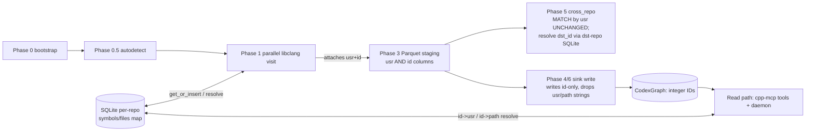

# Design: graph-symbol-ids

Feature: store compact per-repo integer IDs in the CodexGraph; keep the USR/path↔ID maps in SQLite
behind a configurable write-through LRU cache.

Language: Rust (stable; rustfmt + clippy). See `rust-conventions`.

## 1. Goal and the one load-bearing decision

The durable graph (Neo4j + IndraDB) stops storing USR strings on nodes and USR strings on edges, and
stops storing path strings; it stores **integer IDs** instead. The USR↔id and path↔id maps live in a
per-repo SQLite database, fronted by a configurable LRU cache. This shrinks the graph (target ≥30%
node+edge byte reduction, S4-SC-06) because the long, repeated USR/path strings are removed.

The single architectural seam that everything else hangs off (ADR-1):

> **Allocate integer IDs during the parallel libclang visit. Carry BOTH `usr` and the integer `id`
> through the staging/Parquet records. The sink writes id-only. Phase 5 keeps *matching* on `usr`.**

This honours D1 (per-repo IDs; cross-repo *matching* stays in USR space), satisfies S2-SC-10
(allocation happens on the `parallel.rs` path), and satisfies the S4 references to
`arrow.rs`/`nodes.rs`/`edges.rs` (they gain id columns). The rejected sink-only alternative is
recorded in ADR-1.

**Cross-repo caveat (ADR-1 points 4–5):** because integers are repo-local, an EXTERNAL_REF edge
(repo A → repo B) must resolve its `dst_id` through **repo B's** SQLite map, not repo A's. So Phase 5
is *not* fully unchanged: its USR *matching* is unchanged, but its edge *emission* gains a
destination-repo id resolution, and `EdgeRecord` gains `dst_repo_name`. See §3.1 and §3.6.

## 2. ADR index (all `Status: accepted`)

| ADR | Topic | Resolves |
|-----|-------|----------|
| adr-1 | ID namespace: per-repo IDs; cross-repo resolution stays in USR space | D1 |
| adr-2 | SCHEMA_VERSION bump 5→6 (+ tag + PARQUET_MAGIC) | C2, ADR-9 |
| adr-3 | SQLite durable map + thread-safe allocator + write-through LRU | C3,C4,C5,C6; OQ-1 |
| adr-4 | Existing-graph migration: reset/re-index, hard-error (not auto-migrate) | C7; OQ-4 |

Open questions resolved here: **OQ-1** default DB path = `<stage_dir>/cxg-symbols.db` (adr-3);
**OQ-2** field names = `symbol_id` (nodes), `src_id`/`dst_id` (edges), `file_id` (file location)
(§3.3 below); **OQ-3** read-path consumer enumeration (§5); **OQ-4** reset-not-migrate (adr-4).

## 3. Components and data flow

### 3.1 Pipeline phases (changed vs unchanged)



- **Phase 1 (`src/pipeline/parallel.rs`) — CHANGED.** A single `Arc<SymbolAllocator>` is constructed
  per repo and passed in alongside the existing `Arc`-shared atomic counters; threaded through
  `VisitOptions` so the visit, as it emits each `NodeRecord`/`EdgeRecord`, calls
  `get_or_insert_symbol(usr)` / `get_or_insert_file(path)` and attaches the returned integer.
- **Phase 3 staging (`src/schema/arrow.rs`, `nodes.rs`, `edges.rs`) — CHANGED.** Records carry both
  the existing string fields and new integer columns (§3.2/3.3).
- **Phase 5 (`src/resolve/cross_repo.rs`) — MATCHING UNCHANGED, EMISSION CHANGED.** Still builds the
  global map by `usr` and *matches* `cross_repo_candidate` edges by `dst_usr` (D1). But because the
  emitted EXTERNAL_REF must be id-only (S6-SC-03) and integers are repo-local, after matching gives
  the destination `repo_name` Phase 5 opens **that** repo's `<stage_dir>/cxg-symbols.db`, resolves
  `dst_usr → dst_id`, and emits the edge with `src_id`(repo A) + `dst_id`(repo B) + `dst_repo_name`.
  See §3.6.
- **Phase 4/6 sink write (`src/sink/neo4j.rs`, `src/sink/indradb.rs`) — CHANGED.** Write the integer
  IDs; do not write `usr`/`src_usr`/`dst_usr`/`file_path` *strings* to the durable graph.
- **Read path (cpp-mcp tools + daemon) — CHANGED.** Resolve integers back to strings via SQLite
  (§5).

### 3.2 SQLite store (adr-3)

Per-repo DB at `<stage_dir>/cxg-symbols.db` (OQ-1). Two tables, exactly as the AC require:

```sql
CREATE TABLE IF NOT EXISTS symbols (id INTEGER PRIMARY KEY, usr  TEXT NOT NULL UNIQUE);
CREATE TABLE IF NOT EXISTS files   (id INTEGER PRIMARY KEY, path TEXT NOT NULL UNIQUE);
PRAGMA journal_mode=WAL; PRAGMA synchronous=NORMAL;
```

`id INTEGER PRIMARY KEY` = rowid alias → dense monotone IDs from 1 (compactness). Get-or-insert:
`INSERT ... ON CONFLICT(usr) DO NOTHING; SELECT id WHERE usr=?` inside the writer mutex →
exactly-once allocation under concurrency (S2-SC-08/09).

### 3.3 New record fields (OQ-2)

| Record | New field(s) | Type | Notes |
|--------|--------------|------|-------|
| `NodeRecord` | `symbol_id` | `i64` | from `get_or_insert_symbol(usr)`; `usr` retained for Phase 5 |
| `NodeRecord` | `file_id` | `i64` | from `get_or_insert_file(file_path)`; `file_path` retained for Phase 5 |
| `EdgeRecord` | `src_id` | `i64` | from `src_usr`, this repo's map |
| `EdgeRecord` | `dst_id` | `Option<i64>` | from `dst_usr`; `None` mirrors existing `dst_usr: None` skip rule. For intra-repo edges, this repo's map; for EXTERNAL_REF, the **destination** repo's map (§3.6) |
| `EdgeRecord` | `dst_repo_name` | `String` | destination endpoint's repo; `== repo_name` for intra-repo edges; the cross-repo target for EXTERNAL_REF (ADR-1 point 5) |

Arrow columns are appended (`UInt32`/`Int64` per developer choice; `i64` recommended to match
SQLite rowid) so existing `record_batch_to_nodes/edges` keep working for the `usr` fields Phase 5
reads. The **sink** then writes only the integer columns to the durable graph.

### 3.4 Sink write changes (S4, D2 — both sinks)

- **Neo4j (`src/sink/neo4j.rs`):** `CQL_MERGE_NODES` keys on `(symbol_id, repo_name)` instead of
  `(usr, repo_name)`. `CQL_MERGE_EDGES` keys the **source** endpoint on `(src_id, repo_name)` and the
  **destination** endpoint on `(dst_id, dst_repo_name)` — two distinct repo scopes, because the old
  single `repo_name` MATCH cannot address a cross-repo EXTERNAL_REF (ADR-1 point 5). Drop the
  `usr`/`src_usr`/`dst_usr`/`file_path`-string SET clauses; add `symbol_id`/`file_id`/`src_id`/
  `dst_id`/`dst_repo_name`. Replace `CQL_ENSURE_NODE_USR_INDEX` with an index on `:Node(symbol_id)`
  (still `IF NOT EXISTS`). `node_to_bolt`/`edge_to_bolt` emit the integer keys + `dst_repo_name`.
- **IndraDB (`src/sink/indradb.rs`):** same id-only representation (D2, S4-SC-04/05).
- Keep `repo_name` on nodes/edges (it scopes IDs to a repo and is used by reset queries).
- **SCHEMA_VERSION bump to 6 in the same commit** as the first integer write (adr-2, S4-SC-07).

### 3.5 Config surface (S3)

Add to `[index]` (or a small new `[symbols]`) section in `src/config/mod.rs`, with env + CLI in
`src/config/env.rs` / the `clap` args:

| Knob | CLI | Env | Default |
|------|-----|-----|---------|
| cache size | `--symbol-cache-size <N>` | `CXG_SYMBOL_CACHE_SIZE` | documented default (e.g. 100_000) |
| DB path | `--symbol-db-path <PATH>` | `CXG_SYMBOL_DB_PATH` | `<stage_dir>/cxg-symbols.db` |

`cache_size=0` via any surface disables the cache (S3-SC-05 / S2-SC-04). Follow the existing config
pattern (raw struct + `deny_unknown_fields` + `From`/validate); these are non-secret, so no `*_env`
indirection is needed.

### 3.6 Cross-repo EXTERNAL_REF in the integer world (ADR-1 points 4–5)

The hazard: integers are repo-local (D1). An EXTERNAL_REF edge links `src` in repo A to `dst` in
repo B; if `dst_id` were taken from repo A's allocator (the naive "`dst_id` from `dst_usr`") it would
point at nothing in repo B's graph.

Resolution flow inside Phase 5 (`materialise_external_refs`):

1. Match as today: `global_map.get(dst_usr)` → destination `repo_name` (call it `dst_repo`). USR
   matching is unchanged.
2. Open `dst_repo`'s SQLite map at `<its stage_dir>/cxg-symbols.db` (every repo's stage dir is in
   `Phase5Options::stage_dirs`; resolution is cache-fronted/read-only). Resolve `dst_usr → dst_id`.
3. Resolve `src_usr → src_id` via the source repo's map (the repo emitting the edge).
4. Emit `EdgeRecord { src_id, repo_name: src_repo, dst_id: Some(dst_id), dst_repo_name: dst_repo,
   kind: ExternalRef, .. }` (USRs may stay on the staging record for debugging but the **sink writes
   id-only**, so S6-SC-03 holds).

Intra-repo edges set `dst_repo_name == repo_name` and resolve both ids from the one repo map — no
behavioural change for them. This is the only change to Phase 5; `build_global_usr_map`,
`check_schema_version`, and the backend-homogeneity gate are untouched.

## 4. Concurrency (C4, S2-SC-08/09/10)

Single SQLite write `Connection` behind a `std::sync::Mutex` inside `SymbolAllocator`; WAL allows
concurrent reads. One lock, no nesting → deadlock-free. The Phase-5 advisory lock in
`src/sink/lock.rs` is **not** reused here (it is cross-process DB coordination, not in-process map
allocation) — see adr-3. The LRU is a separate `Mutex`/`RwLock`-guarded structure; write-through
order is **SQLite first, then cache**, so eviction can never lose data (C5, S2-SC-03).

## 5. Read / query path (S5, C1) — consumer enumeration (OQ-3)

Every consumer that surfaces a symbol name or filename must resolve integer→string via the
repo-scoped SQLite reverse lookups (`id→usr`, `id→path`), cache-fronted:

- **In-scope (must resolve before returning):**
  - cpp-mcp tools: `get_definition`, `get_references`, `get_ast`, `query_graphdb` (and any tool that
    echoes node/edge symbol or file fields). See `[[pages/code/cpp-mcp]]`.
  - daemon (`cxg-daemon`): `GET /v1/repos` and any endpoint returning symbol/filename data.
- **Resolver contract:** resolve through the *correct repo's* SQLite map (IDs are repo-local, D1).
  For an EXTERNAL_REF edge, resolve `src_id` via `repo_name`'s map and `dst_id` via `dst_repo_name`'s
  map (§3.6). On missing/unknown ID or unavailable SQLite, return an **explicit error / documented
  degradation** — never fabricate or blank-out (C7, S5-SC-03). String contract preserved (S5-SC-04).
- **Deferred / follow-up (record explicitly, do not silently skip):** any internal tooling, exports,
  or scripts that read the graph directly outside cpp-mcp + daemon. The developer must grep for
  readers of `usr`/`src_usr`/`dst_usr`/`file_path` graph properties and either convert them or list
  them in implementation-notes.md as deferred. cpp-mcp lives in a separate repo; cross-repo wiring of
  the resolver there is a coordinated change — flag in plan.md.

## 6. Migration / compatibility (S6, C7 — adr-4)

Hard-error on v5→v6 mismatch at the handshake; reset/re-index is explicit and operator-driven; no
auto-migrate, no dual-write. A fresh v6 index produces a graph with no `usr`/`src_usr`/`dst_usr`
string properties (S6-SC-03). Runbook documents: stop writers → `reset` → re-index v6 (S6-SC-04).
Extend the version gate to the write path so `cxg-index` refuses to append v6 onto a v5 graph without
`reset` (adr-4 follow-up i).

## 7. Files to touch (for senior-developer / plan.md)

- New: `src/resolve/symbol_map.rs` (or `src/symbols/`) — `SymbolAllocator` (SQLite + LRU + both
  directions). Add `rusqlite` (bundled feature) to `Cargo.toml`.
- `src/pipeline/parallel.rs` — construct + inject `Arc<SymbolAllocator>`; thread through `VisitOptions`.
- `src/visit/shallow.rs` (and callers) — attach `symbol_id`/`file_id`/`src_id`/`dst_id` on emit.
- `src/schema/nodes.rs`, `src/schema/edges.rs`, `src/schema/arrow.rs` — new integer fields/columns.
- `src/schema/version.rs` — bump to 6 (+ tag + magic) **same commit** (adr-2).
- `src/sink/neo4j.rs`, `src/sink/indradb.rs` — id-only writes; index on `symbol_id`.
- `src/config/mod.rs`, `src/config/env.rs`, CLI args — cache size + DB path (S3).
- Read path: cpp-mcp tool layer + `cxg-daemon` endpoints — id→string resolution (S5).
- `src/resolve/cross_repo.rs` — **DO NOT change the USR *matching* logic** (`build_global_usr_map`,
  homogeneity/schema gates — USR space, D1). DO change `materialise_external_refs` to resolve
  `src_id`/`dst_id` via the source/destination repo SQLite maps and set `dst_repo_name` (§3.6).
- Tests: unit (map + LRU, S7-SC-01..11), integration (re-index ID stability S7-SC-12, both-sink
  round-trip S7-SC-13/14, regression S7-SC-15), size measurement (S4-SC-06).

## 8. Traceability (story → ADR → constraint)

| Story | ADR(s) | Constraints |
|-------|--------|-------------|
| S1 SQLite map | adr-1, adr-3 | C3, C6 |
| S2 allocator + LRU | adr-3 | C4, C5 |
| S3 config | adr-3 | C5, C6 |
| S4 both sinks id-only | adr-1, adr-2 | C2 |
| S5 read resolution | adr-1, adr-4 | C1, C7 |
| S6 migration | adr-4 | C7 |
| S7 tests | all | C3,C4,C5 + size goal |

## References

- requirements.md, scenarios.md, CHARTER.md (this run)
- adr-1..adr-4 (this run); ADR-9 (project schema-bump policy)
- Code: `src/pipeline/parallel.rs`, `src/resolve/cross_repo.rs`, `src/schema/{nodes,edges,arrow,version}.rs`,
  `src/sink/{neo4j,indradb,lock}.rs`, `src/config/{mod,env}.rs`
- Wiki: `[[pages/code/cpp-indexer]]`, `[[pages/code/cpp-mcp]]`
- cognee tags: `task:graph-symbol-ids`, `role:architect`
