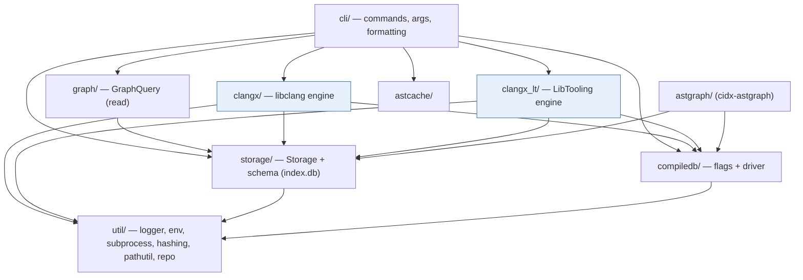
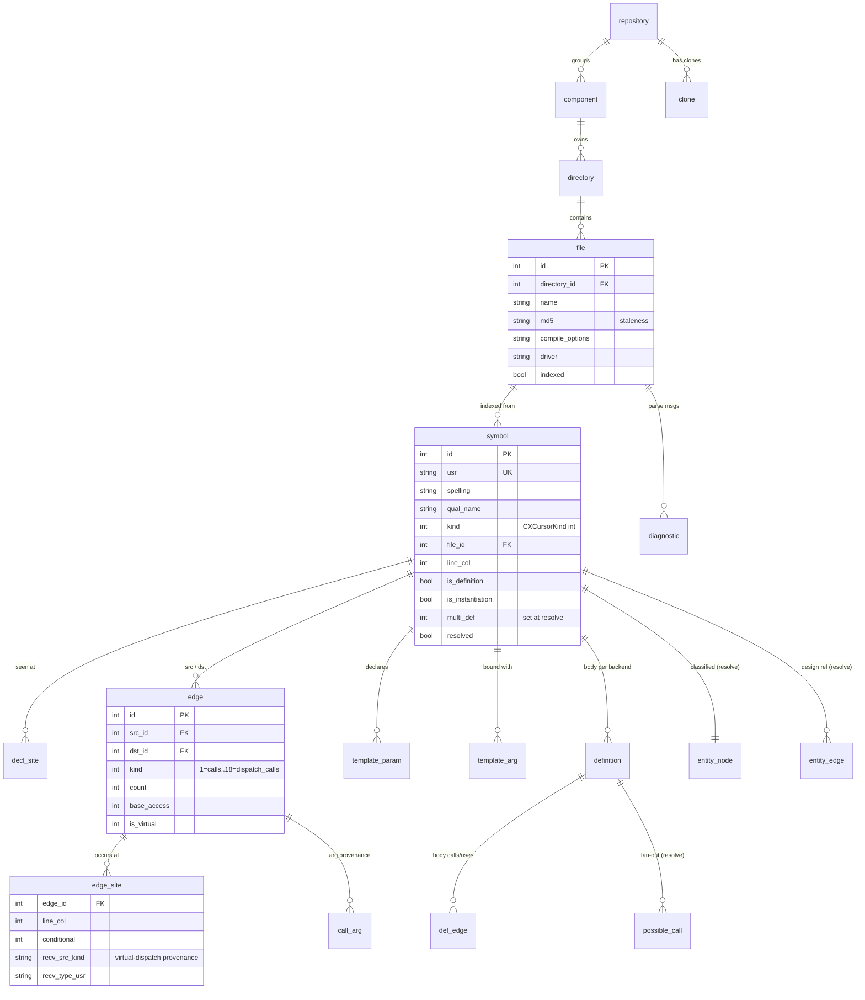
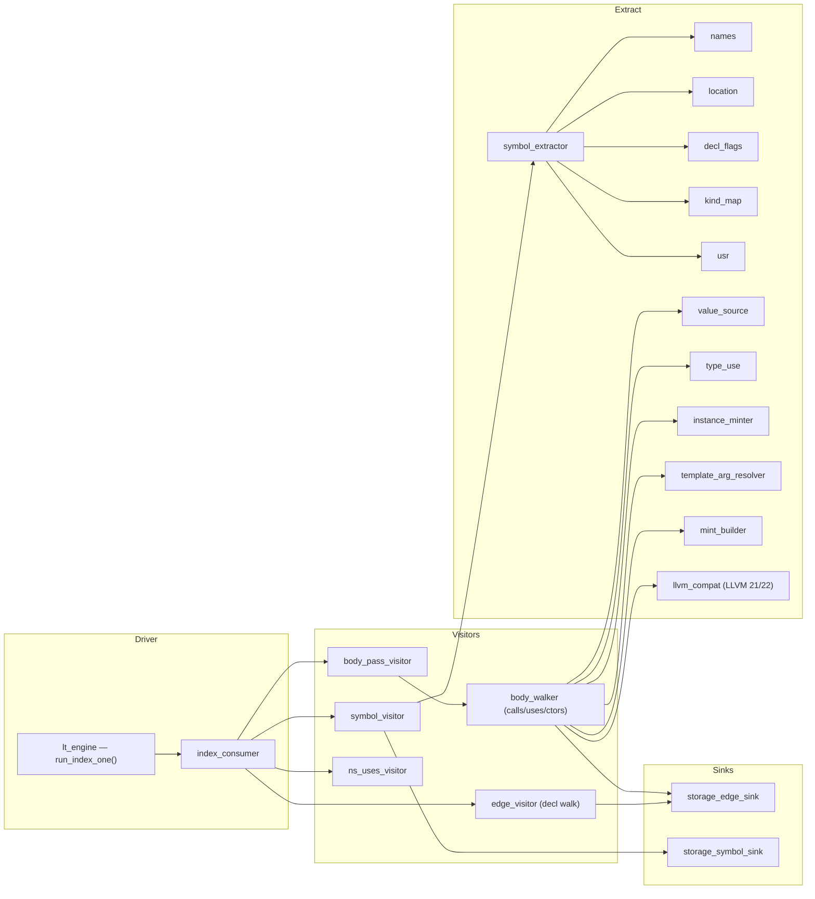
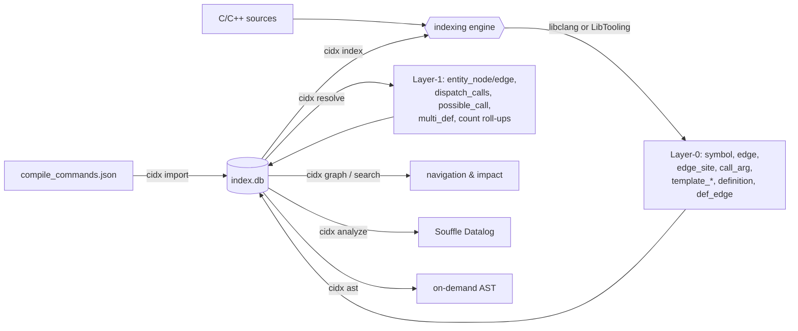
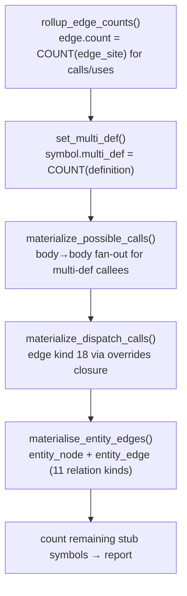

# cidx — Architecture & Implementation Guide

`cidx` is a semantic indexer for C and C++ codebases. It parses translation
units with Clang, extracts a symbol-level relationship graph, stores it in a
single SQLite database (`index.db`), and exposes navigation/query commands
(callers, callees, references, class hierarchy, virtual dispatch, impact
analysis) plus Datalog analyses over the result.

This document describes the **C++23 implementation** under `src/` (the canonical
implementation is mirrored by a reference Python implementation under
`python/indexer/`; the two are kept behaviorally identical). It covers the
application structure, the classes in each module, the on-disk data model, and
the data-flow through indexing, resolution, and query — including the **two
interchangeable indexing engines** (libclang C API and the Clang C++ API /
LibTooling).

---

## Table of Contents

- [1. Overview](#1-overview)
- [2. Application Structure](#2-application-structure)
  - [2.1 Module map](#21-module-map)
  - [2.2 Layering](#22-layering)
- [3. The Two Indexing Engines](#3-the-two-indexing-engines)
- [4. Data Model (schema 28)](#4-data-model-schema-28)
  - [4.1 Entity–relationship diagram](#41-entityrelationship-diagram)
  - [4.2 Table reference](#42-table-reference)
  - [4.3 The three graph layers](#43-the-three-graph-layers)
- [5. Classes by Module](#5-classes-by-module)
  - [5.1 `src/cli` — command dispatch](#51-srccli--command-dispatch)
  - [5.2 `src/storage` — the database layer](#52-srcstorage--the-database-layer)
  - [5.3 `src/compiledb` — compile-command handling](#53-srccompiledb--compile-command-handling)
  - [5.4 `src/clangx` — the libclang engine](#54-srcclangx--the-libclang-engine)
  - [5.5 `src/clangx_lt` — the LibTooling engine](#55-srcclangx_lt--the-libtooling-engine)
  - [5.6 `src/graph` — read-only query API](#56-srcgraph--read-only-query-api)
  - [5.7 `src/astcache` — the AST cache](#57-srcastcache--the-ast-cache)
  - [5.8 `src/astgraph` — per-TU AST graph tool](#58-srcastgraph--per-tu-ast-graph-tool)
  - [5.9 `src/util` — foundations](#59-srcutil--foundations)
- [6. Data Flow](#6-data-flow)
  - [6.1 End-to-end pipeline](#61-end-to-end-pipeline)
  - [6.2 Indexing one translation unit (sequence)](#62-indexing-one-translation-unit-sequence)
  - [6.3 The per-file interleave](#63-the-per-file-interleave)
  - [6.4 The resolve pass](#64-the-resolve-pass)
  - [6.5 Query & analyze](#65-query--analyze)
- [7. Build & Platforms](#7-build--platforms)
- [8. Glossary](#8-glossary)

---

## 1. Overview

cidx works in four stages, each a CLI subcommand backed by the shared
`index.db`:

| Stage | Command | Produces |
|---|---|---|
| **Import** | `cidx import <compile_commands.json>` | `component`/`directory`/`file` rows with per-file compile options |
| **Index** | `cidx index` | `symbol` + Layer-0 graph (`edge`, `edge_site`, `call_arg`, `template_*`, `definition`, `def_edge`) |
| **Resolve** | `cidx resolve` | Layer-1 (`entity_node`, `entity_edge`), materialized `dispatch_calls`, `possible_call`, roll-ups |
| **Query** | `cidx graph …`, `search`, `analyze`, `ast …` | navigation, impact analysis, Datalog results, on-demand AST |

Two design invariants shape the whole codebase:

- **Byte-for-byte parity** with the Python reference implementation — text/JSON
  output, USRs, hashes, and DB rows are identical. Many helpers exist purely to
  reproduce Python/`os.path`/`json.dumps` semantics exactly.
- **Driver introspection.** The parser (`libclang`/LibTooling) is Clang, but the
  *include search paths* are replicated from whatever compiler `driver` the
  `compile_commands.json` names (e.g. a specific `g++`) by running
  `<driver> -E -x <lang> - -v`. This lets cidx index real GCC-built code
  correctly regardless of the parser.

---

## 2. Application Structure

### 2.1 Module map

```
src/
├── main.cpp            entry point: parse args → build Context → run_command
├── cli/                command dispatch, arg parsing, output formatting   (~8.4k LOC)
│   ├── args.*          ParsedArgs + hand-rolled parser (argparse parity)
│   ├── commands.*      Context + run_command + every cmd_* handler
│   ├── format.*        symbol-table / f-string output helpers
│   ├── json_out.*      json.dumps(indent=2) byte-replica
│   ├── kind_names.*    CXCursorKind id ↔ name
│   └── analyze.cpp     `cidx analyze` (Souffle Datalog over the index)
├── storage/            the SQLite database layer                          (~5.5k LOC)
│   ├── storage.*       Storage class, schema, migrations, resolve pass
│   ├── sqlite.*        thin RAII wrapper over libsqlite3
│   └── records.hpp     plain-data row structs (Symbol, Edge, EdgeSite, …)
├── compiledb/          compile_commands.json load + sanitize + aliasing   (~0.6k LOC)
├── clangx/             libclang (C API) indexing engine  [default]        (~6.4k LOC)
├── clangx_lt/          Clang C++ API (LibTooling) indexing engine [opt-in] (~5.0k LOC)
├── graph/              read-only GraphQuery + emitters                    (~1.4k LOC)
├── astcache/           on-disk libclang TU cache for `cidx ast`          (~0.4k LOC)
├── astgraph/           `cidx-astgraph`: per-TU raw AST graph + Souffle    (~1.1k LOC)
└── util/               logger, env, subprocess, hashing, pathutil, repo … (~1.7k LOC)
```

### 2.2 Layering



Both engines depend only on `storage`, `compiledb`, and `util`; they are
mutually exclusive at runtime and produce **identical** database rows. `graph`
is strictly read-only.

---

## 3. The Two Indexing Engines

cidx contains two implementations of the AST→graph extraction ("Layer-0"),
selected at runtime by the `CIDX_INDEX_ENGINE` environment variable:

| | `clangx/` (default) | `clangx_lt/` (`CIDX_INDEX_ENGINE=lt`) |
|---|---|---|
| API | **libclang** — stable C API (`clang-c/Index.h`), cursor walk | **LibTooling** — Clang C++ API, `RecursiveASTVisitor` |
| Links | `libclang.so` | `libclang-cpp` + `libLLVM` (shared) |
| Portability | one binary across LLVM versions | pinned to the LLVM major it builds against |
| Fidelity | ~80% of C++ surface (some props always-false, no Concepts, `-1` template args) | full AST (real template args, Concepts, resolved dependent calls) |

Both engines share the *same* flag/driver assembly (`compiledb` +
`clangx/toolchain`) and write through the *same* `Storage` API, so their output
is byte-identical at schema 28. The LibTooling engine was added to unlock the
fidelity gaps for future work while proving itself a drop-in replacement first.
The selection happens in one place — `index_one` in `cli/commands.cpp`.

---

## 4. Data Model (schema 28)

Everything lives in one SQLite file, `index.db`. Identity is the **USR**
(Unified Symbol Resolution string, e.g. `c:@N@geo@S@Circle@F@area#1`), which is
stable across translation units and identical between the two engines.

### 4.1 Entity–relationship diagram



### 4.2 Table reference

**Structural / ownership**

| Table | Purpose |
|---|---|
| `meta` | key/value; holds `schema_version` (28) and `graph_resolved_at` |
| `repository`, `clone` | group components; track git clones / active clone |
| `component` | a source root (repo/dir); name, path, kind, version |
| `directory` | a directory under a component |
| `file` | one source/header file: `md5` (staleness), `compile_options`, `driver`, `indexed` |
| `diagnostic` | parse warnings/errors kept per file |

**Layer-0 — raw extraction (written by the indexing engine)**

| Table | Purpose |
|---|---|
| `symbol` | one row per USR: spelling, qualified/display name, `kind` (raw `CXCursorKind` int), type, location + full extent, decl site, flags (`is_definition/pure/static/instantiation/named_instance`), `linkage`, `access`, `parent_usr`, `resolved` |
| `decl_site` | every physical (file,line,col) a symbol is seen at (all re-openings) |
| `symbol_kind`, `edge_kind` | id→name catalogs (display only) |
| `edge` | `src→dst` relationship of a `kind` (1 calls, 2 inherits, 3 contains, 4 specializes, 5 instantiates, 6 overrides, 7 uses, 8 field_of, 9 method_of, 10–16 construct/destroy forms, 17 friend, 18 dispatch_calls); `count`, `base_access`, `is_virtual`, `vtable_slot` |
| `edge_site` | per-occurrence (file,line,col) of an edge + `conditional` + call-receiver provenance (`recv_src_kind/type_usr/decl_usr/param_pos/type_is_value`) |
| `call_arg` | per-argument value-source classification at a call site |
| `template_param` | template parameters of a template symbol |
| `template_arg` | concrete arguments of a specialization/instantiation (`arg_kind`, `literal`, `ref_id`) |
| `definition` | a symbol's *body per backend/TU* (v27 multi-definition); location + `init_text` |
| `def_edge` | a definition's outgoing calls/uses (snapshot, survives cross-TU edge rewrites) |
| `label` | include-path alias tokens (`<label>`) for portable stored options |

**Layer-1 — design graph + roll-ups (written by `cidx resolve`)**

| Table | Purpose |
|---|---|
| `entity_node` | each type symbol classified into a design kind (class / abstract_class / interface / union / enum + template variants) |
| `entity_edge` | derived entity-level relations (generalizes, implements, specializes, composes, aggregates, associates, creates, uses, destroys, befriends, instantiates, declares) |
| `possible_call` | body→body call fan-out for multiply-defined callees |
| `edge` kind 18 (`dispatch_calls`) | materialized virtual-dispatch caller edges (via the `overrides` closure) |

### 4.3 The three graph layers

1. **Layer-0** — what the AST literally contains (symbols + edges). Written by
   `clangx` or `clangx_lt`. This is where the two engines must agree byte-for-byte.
2. **Definition layer** — `definition` / `def_edge` capture per-body call/use
   sets so a symbol defined differently in several TUs keeps each body's edges.
3. **Layer-1** — the *design* graph (`entity_node`/`entity_edge`) plus the
   `dispatch_calls` and `possible_call` roll-ups, all derived from Layer-0 by a
   pure database transform at `cidx resolve`.

---

## 5. Classes by Module

### 5.1 `src/cli` — command dispatch

- **`Context`** (`commands.hpp:25`) — per-invocation state handed to every
  command: `cache_dir`, `index_path` (`<cache_dir>/index.db`), `Logger*`, and
  `out`/`err` streams (tests capture them). `resolve_cache_dir()` implements
  `$INDEXER_CACHE` else `~/.cache/cidx`.
- **`ParsedArgs`** + **`parse_args()`** (`args.hpp`) — a hand-rolled parser that
  mirrors the Python argparse command tree; throws `UsageError` (exit 2).
- **`run_command()`** (`commands.cpp:3486`) — flat dispatch on `args.command`
  (and `args.what` for grouped commands). `main()` (`main.cpp:49`) wires
  args → `Context` → `run_command`.
- **Command handlers** (`cmd_*` in `commands.cpp`): `cmd_init`, `cmd_import`,
  `cmd_index`, `cmd_resolve`, `cmd_search`, listings/show/delete for
  component/dir/file/symbol, `cmd_graph_*` (callers/callees/refs/neighbors/
  walk/path/hierarchy/dispatch/redefined/definitions), `cmd_ast_*`,
  `cmd_pch_*`, `cmd_repo_*`, `cmd_verify`, and `cmd_analyze` (in `analyze.cpp`).
- **Formatting**: `format.hpp` (symbol-table + Python f-string helpers,
  `print_symbols`), `json_out.hpp` (a `Value` tree serialized as a byte-replica
  of `json.dumps(indent=2)` for `--json`).

### 5.2 `src/storage` — the database layer

- **`Storage`** (`storage.hpp:61`) — owns the connection and the entire schema.
  Creates/migrates the DB (schema_version 28, migrations `v2→v28`), and exposes
  the write API used by both engines: `add_symbol`, `mint_symbol_id` (USR-keyed
  stub upsert), `add_edge`, `add_edge_site`, `add_call_arg`, `add_template_param`,
  `add_template_arg`, `get_or_create_definition`, `add_def_edge`,
  `copy_body_edges_to_def_edge`, plus lookups (`lookup_symbol`,
  `lookup_symbols_by_[qual_]name`, `get_file`, `component_for_path`) and the
  cleanup used on re-index (`delete_edges_for_file`, `delete_definitions_for_file`).
  Also hosts **`resolve_pass()`** (§6.4).
- **`Transaction`** (`storage.hpp:45`) — RAII commit/rollback; indexing wraps
  each file's writes in one.
- **`sqlite.hpp`** — a minimal RAII wrapper (`Db`, prepared `Stmt`, `bind`/`step`/
  `col_*`) over libsqlite3 (requires SQLite ≥ 3.35 for `RETURNING`).
- **`records.hpp`** — plain-data row structs: `Symbol`, `Edge`, `EdgeSite`,
  `CallArg`, `TemplateParam`, `TemplateArg`, `File`, `Component`, `Diagnostic`,
  `Definition`, etc. These cross module boundaries; no clang types leak here.

### 5.3 `src/compiledb` — compile-command handling

- **`CompileCommand`** (`compiledb.hpp:25`) — `directory`, `filename`, `driver`,
  `args`.
- **`CompileDb`** (`compiledb.hpp:32`) — loads `compile_commands.json` through
  libclang's `CXCompilationDatabase` (never own JSON parsing, so shell-unquoting
  matches Python). Key operations:
  - `strip_for_libclang(...)` — parse-time flag strip (drop `argv[0]`, the frozen
    drop sets, the source file; absolutize `-I/-isystem/-iquote`).
  - **`sanitize(stored)`** — re-apply only the drop rules to already-stored
    options (heals DBs imported by an older cidx).
  - `driver(...)` — locate/absolutize the real compiler, skipping env
    assignments and wrappers (ccache/sccache/distcc).
  - **`resolve_options(...)`** — decode `<label>`/`$VAR`/`~` include tokens back
    to absolute dirs so the parser sees real paths.

### 5.4 `src/clangx` — the libclang engine

- **`AstIndexer`** (`ast.hpp:45`) — the extraction orchestrator. Public passes:
  `index_symbols`, `index_headers` (two-pass over owned headers), `index_edges`.
  Private cursor-walk primitives `for_file_cursors` / `for_file_cursors_p`
  (parent-aware) prune to the target file and stop at function bodies (descended
  explicitly). The symbol pass (`ast_symbols.cpp`), the declaration-edge +
  body-descent pass (`ast_edges.cpp`, `ast_body.cpp`), and template-argument
  recovery (`ast_templates.cpp`, incl. the token fallback where libclang returns
  `-1`) live in separate files.
- **`Parser`** (`parse.hpp`) — wraps `clang_parseTranslationUnit`; assembles
  `opts + toolchain_flags + -ferror-limit=0`; captures diagnostics; enforces the
  fatal-diagnostic policy (`CIDX_STRICT`).
- **`Toolchain`** (`toolchain.hpp`) — **driver introspection**:
  `toolchain_flags(is_cpp, driver)` appends the driver's replicated system
  include search list (`driver_search_dirs` runs `<driver> -E -x <lang> - -v`),
  plus sysroot/resource-dir; memoized per `(driver, lang)`.
- **`CxString`** / `clang_raii.hpp` — RAII for libclang-owned handles.
- Also: `pch.*` (shared system precompiled header), `clang_runtime.*` (libclang
  discovery + version), `ast_query.*` (the on-demand `cidx ast` walkers).

### 5.5 `src/clangx_lt` — the LibTooling engine

A one-class-per-file layer (30 headers) reproducing Layer-0 via the Clang C++
API. Grouped by role:



- **`run_index_one`** (`lt_engine`) — the drop-in for `index_one`'s parse+index
  block: builds a `ClangTool` with the same flags, records `#include`s via a
  `PPCallbacks`, collects diagnostics, and drives the interleaved pass sequence,
  applying the same fatal-diagnostic gate.
- **Visitors** — `SymbolVisitor` (symbol pass), `EdgeVisitor` (declaration-level
  edges: contains/inherits/field_of/method_of/overrides/friend/specializes +
  template params/args + signature uses), `BodyPassVisitor` +`BodyWalker` (body
  descent: calls with dependent/overload recovery, uses, the 7 construct/destroy
  forms, receiver + `call_arg` provenance, cond-depth, definitions/def_edges),
  `NsUsesVisitor` (namespace-qualifier uses).
- **Extraction helpers** — `symbol_extractor`/`names`/`location`/`decl_flags`/
  `kind_map`/`usr` reproduce libclang's spellings, extents, kind integers and
  USRs exactly; `value_source`/`type_use`/`instance_minter`/`template_arg_resolver`
  handle body-side classification and template instances; **`llvm_compat`**
  localizes the LLVM 21↔22 API differences (NestedNameSpecifier, `APSInt`
  formatting).
- **Sinks** — `EdgeSink`/`SymbolEmitter` interfaces; the visitors depend only on
  these, so `StorageEdgeSink`/`StorageSymbolSink` (which wrap `Storage`) are the
  only files that touch storage. `TsvSymbolEmitter` is a test/probe sink.

### 5.6 `src/graph` — read-only query API

- **`GraphQuery`** (`query.hpp:85`) — a read-only view over `Storage`. Symbol
  lookup (`get_by_id/usr`, fuzzy `find`), edge traversal (`edges_in/out`,
  `references`, `sites`), navigation (`peers`, `walk` bounded BFS, `reaches`
  shortest path), hierarchy (`bases`, `subclasses`, `members`), dispatch
  (`overrides_of`, `dispatch_targets`, `is_virtual_method`), and multi-definition
  (`redefined`, `definitions`, `possible_callees`). Raises `NoIndexError` /
  `NoEdgesError` on an empty graph.
- **Emitters** (`emit.hpp`) — `emit_edges` / `emit_syms` render results as tables
  or `--json`. These back the `cidx graph …` subcommands.

### 5.7 `src/astcache` — the AST cache

Caches libclang translation units as `.ast` files under
`~/.cache/cidx/files/` with a JSON validity sidecar (byte-parity with Python,
so `.ast` files interop). `AstTarget` (abspath+flags+driver+focus),
**`cache_key`** (SHA-1 of `abspath\0flags[\0drv\0driver]`), **`flags_hash`**
(flags-only), a `Sidecar` (`is_valid` checks src mtime + flags_hash +
libclang_version + abspath), and `load_or_parse` — a cache hit returns a
`ParsedTu`, else a live reparse. Used by `cidx ast`.

### 5.8 `src/astgraph` — per-TU AST graph tool

`cidx-astgraph` is a *separate* binary that dumps **one** TU's raw libclang AST
(cursors AND types unified as `node` rows, every relation an `edge(src,dst,rel,ord)`
row) into a per-TU SQLite graph for Datalog reasoning — far finer-grained than
the repo-wide semantic index. It **shares cidx's config**: it reads the file's
compile args + driver from the cidx `index.db`, re-runs `sanitize` +
`resolve_options`, parses through the same `Toolchain`/`Parser`, then
`dump_tu(...)`. It can run an embedded native Souffle `callgraph` rule over that
artifact.

> `cidx-astgraph` (per-TU raw AST + native Souffle) vs `cidx analyze` (Souffle
> Datalog — `callgraph`/`cycles`/`unused` — over facts exported from the whole
> repo-wide semantic `index.db`).

### 5.9 `src/util` — foundations

`logger` (Python-parity logging, lazy file, warning counter), `env` (env lookup
+ the distinct falsy-spelling sets), `subprocess` (`posix_spawnp` runner for the
driver probe: empty stdin, 30 s timeout, never throws), `hashing` (`md5_of` for
staleness), `json_min` (arrays-of-strings codec for `compile_options`),
`pathutil` (POSIX `os.path` semantics reimplemented for DB-stable paths), `repo`
(git discovery via `.git/config`, worktree-aware), `files` (file-arg resolution
+ md5-only index-state check), `errors` (`CidxError`/`UsageError`/`StorageError`).

---

## 6. Data Flow

### 6.1 End-to-end pipeline



### 6.2 Indexing one translation unit (sequence)

`cidx index` iterates pending files (or explicit `FILE…` args). For each source
TU:

```mermaid
sequenceDiagram
    autonumber
    participant CMD as cmd_index / index_one
    participant CDB as CompileDb
    participant TC as Toolchain (driver probe)
    participant ENG as Engine (libclang | LibTooling)
    participant DB as Storage (index.db)

    CMD->>CDB: sanitize(stored opts) + resolve_options(labels)
    CMD->>TC: toolchain_flags(is_cpp, driver)
    TC-->>CMD: driver-replicated -isystem paths (+ -resource-dir)
    CMD->>ENG: parse TU (opts + toolchain flags + -ferror-limit=0)
    Note over ENG: diagnostics collected; fatal ≥ abort level ⇒ NO rows, file fails
    ENG->>DB: index_symbols(main file)
    loop each owned, non-system header (pass 1)
        ENG->>DB: add_file_path + index_symbols(header)
    end
    loop each owned header (pass 2)
        ENG->>DB: delete stale edges/defs + index_edges(header)
    end
    ENG->>DB: index_edges(main file)  [decl walk → body descent → ns-uses]
    CMD->>DB: replace_diagnostics + mark_file_indexed(md5, mtime)
    Note over CMD,DB: run once per file; `cidx resolve` runs afterward (§6.4)
```

The two engines implement steps 6–10 identically; `CIDX_INDEX_ENGINE=lt` swaps
the implementation, not the sequence.

### 6.3 The per-file interleave

The ordering in step 6–10 is **load-bearing**, not incidental:

- Symbols for the **main file** are written first, then symbols for every owned,
  non-system **header** (pass 1), then **edges** for those headers (pass 2), then
  edges for the main file **last**.
- During the main file's edge walk, header-owned symbols already exist, but the
  reverse is not true: header edges whose source symbol belongs to the main file
  are *deleted then re-emitted once* by the main-file walk (`delete_edges_for_file`
  excludes `contains`, keyed by the source symbol's winning file). This collapses
  cross-file double-emissions and makes re-indexing idempotent.
- A header included by many TUs is indexed once (md5-gated) and stamped with the
  including TU's options so it stays standalone-reparseable.

### 6.4 The resolve pass

`cidx resolve` → `Storage::resolve_pass()` runs pure SQL transforms over Layer-0
(no re-parsing) and stamps `meta.graph_resolved_at`:



- `entity_node` — each type symbol (class/struct/union/enum/class-template)
  classified into a design kind (class, abstract_class, interface, union, enum +
  template variants).
- `entity_edge` — derived entity relations (generalizes/implements/specializes/
  composes/aggregates/associates/creates/uses/destroys/befriends/instantiates/
  declares).
- `dispatch_calls` (edge kind 18) — for each `caller → virtual base method`
  call, edges to every transitive override (recursive CTE over `overrides`), so
  `callers(concrete_override)` recovers the virtual caller in one hop.
- `possible_call` — for calls into a symbol with `multi_def > 1`, a body→body
  fan-out to each definition.

### 6.5 Query & analyze

- `cidx graph <sub>` → `GraphQuery` reads the resolved graph and `emit_*` renders
  text or `--json`. Dispatch/impact queries rely on the resolve-time
  `dispatch_calls` / `possible_call` tables.
- `cidx search` → fuzzy qual-name match, shared symbol-table output.
- `cidx analyze` → exports `symbol/edge/edge_site/entity_*/file` to TSV and runs
  Souffle Datalog rules (`callgraph`, `cycles`, `unused`).
- `cidx ast <sub>` → on-demand libclang walk over a single file (cached via
  `astcache`), independent of the stored graph.

---

## 7. Build & Platforms

- **CMake, C++23.** Build hosts: macOS AppleClang 15+ / Linux gcc 13+
  (gcc-toolset-13 on RHEL 9). SQLite ≥ 3.35 required (`RETURNING`).
- **libclang headers** come from the *installed* LLVM (via `find_path` for
  `clang-c/Index.h`), same prefix as the linked `libclang` — no vendored headers.
- **The LibTooling engine** links the shared Clang C++ API (`clang-cpp` +
  `libLLVM`); its sources compile in a `cidx_lt` OBJECT library with `-isystem`
  LLVM headers and `-fno-rtti`. On Linux, `libstdc++` stays dynamic (the shared
  `libLLVM` uses the system one — a static libstdc++ would corrupt the ABI).
- **macOS**: `cmake -DCMAKE_PREFIX_PATH=$(brew --prefix llvm)` picks up brew LLVM
  automatically.
- **RHEL 9 / Rocky 9**: `scripts/build-rhel9.sh` installs deps (`DEPS_ONLY=1` to
  stop after deps; `dnf upgrade` unless `SKIP_UPDATE=1`), builds a static SQLite
  amalgamation, and configures with `LLVM_DIR`/`Clang_DIR` from `llvm-config`.
  Runtime needs `clang-libs` + `llvm-libs`.
- **Verification**: `scripts/lt_index_diff.sh` (full-DB dual-engine parity),
  `scripts/lt_symbol_diff.sh` (symbol parity), `scripts/e2e_lt_gcc_driver.sh`
  (GCC-driver replication + parity), plus `ctest`.

---

## 8. Glossary

- **USR** — Unified Symbol Resolution string; Clang's stable, TU-invariant
  symbol identity and cidx's primary key.
- **Layer-0** — raw AST-extracted symbols + edges (engine output).
- **Layer-1** — the derived design graph (`entity_node`/`entity_edge`) and
  roll-ups produced at `cidx resolve`.
- **Driver introspection** — replicating a specific compiler's include search
  paths by running `<driver> -E -x <lang> - -v`, so Clang parses with the right
  headers even for GCC-built code.
- **Stub** — a USR-keyed placeholder `symbol` minted for a target not yet
  indexed (e.g. a callee in another TU); backfilled when its defining TU is
  indexed.
- **`multi_def`** — number of bodies (definitions) a symbol has across backends;
  drives `possible_call` and the `redefined`/`definitions` queries.
```
