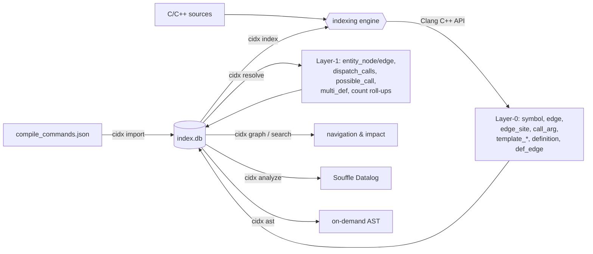
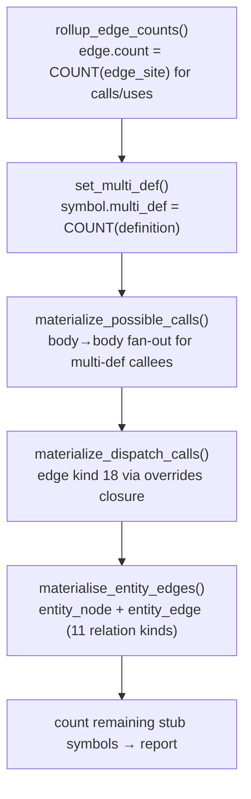

# Data Flow

[← docs index](README.md)

## End-to-end pipeline



- **Import** — `cmd_import` ([cli](modules/cli.md)) loads `compile_commands.json`
  through [`CompileDb`](modules/compiledb.md) into `component`/`directory`/`file`
  rows with per-file `compile_options` + `driver`.
- **Index** — `cmd_index` walks pending files and runs the
  [indexing engine](modules/ast.md) per TU (below).
- **Resolve** — `cmd_resolve` → `Storage::resolve_pass()` (below). Indexing
  normally publishes derived facts immediately; `--defer-transforms` leaves
  the committed Layer-0 generation pending for a later DB-only resolve.
- **Query** — [`graph`](modules/graph.md), `search`,
  [`analyze`](modules/astgraph.md#cidx-astgraph-vs-cidx-analyze).

## Indexing one translation unit

`cidx index` iterates pending files (or explicit `FILE…` args). For each source
TU, `index_one` ([cli/commands.cpp](modules/cli.md)) runs:

```mermaid
sequenceDiagram
    autonumber
    participant CMD as cmd_index / index_one
    participant CDB as CompileDb
    participant TC as Toolchain (driver probe)
    participant ENG as ast/ (run_index_one)
    participant DB as Storage (index.db)

    CMD->>CDB: sanitize(stored opts) + resolve_options(labels)
    CMD->>TC: toolchain_flags(is_cpp, driver)
    TC-->>CMD: driver-replicated -isystem paths (+ -resource-dir)
    CMD->>ENG: parse TU (opts + toolchain flags + -ferror-limit=0)
    Note over ENG: diagnostics collected; fatal ≥ abort level ⇒ NO rows, file fails
    ENG->>DB: index_symbols(main file)
    loop each owned, non-system header (pass 1)
        ENG->>DB: add_file_path + index_symbols(header)
    end
    loop each owned header (pass 2)
        ENG->>DB: delete stale edges/defs + index_edges(header)
    end
    ENG->>DB: index_edges(main file)  [decl walk → body descent → ns-uses]
    CMD->>DB: replace_diagnostics + mark_file_indexed(md5, mtime)
    Note over CMD,DB: publish derived facts now, or persist pending work with `--defer-transforms`
```

`ast::run_index_one` implements steps 4–10; the per-TU stages are the named
methods of `TranslationUnitIndexer` ([ast](modules/ast.md)).

## The per-file interleave

The ordering in steps 6–10 is **load-bearing**, not incidental:

- Symbols for the **main file** are written first, then symbols for every owned,
  non-system **header** (pass 1), then **edges** for those headers (pass 2), then
  edges for the main file **last**.
- During the main file's edge walk, header-owned symbols already exist, but not
  vice-versa: header edges whose source symbol belongs to the main file are
  *deleted then re-emitted once* by the main-file walk
  (`delete_edges_for_file` excludes `contains`, keyed by the source symbol's
  winning file). This collapses cross-file double emissions and makes
  re-indexing idempotent.
- A header included by many TUs is indexed once (md5-gated) and stamped with the
  including TU's options so it stays standalone-reparseable.

The [`ast`](modules/ast.md) page describes how the engine implements this
sequence.

The replacement boundary is specified in [Immutable FactBatch](fact-batch.md):
serial extraction publishes one partitioned, canonical batch without storage
access, then application-owned replay applies it transactionally in
`(component.path, directory.path, file.name)` order. The current direct path is
retained as the conformance oracle until controlled planning/publication land.

## The resolve pass

`cidx resolve` → `Storage::resolve_pass()` runs pure SQL transforms over
Layer-0 (no re-parsing) and stamps `meta.graph_resolved_at`. The indexer records
a trusted, durable union of pre-replacement and committed fact IDs for each TU.
When a published baseline exists, the first four transforms consume that
bounded change set; entity projection remains a generation-gated full rebuild:



- **`rollup_edge_counts()`** (`storage.cpp:2816`) — `edge.count = COUNT(edge_site)`
  for calls (1) and uses (7).
- **`set_multi_def()`** (`storage.cpp:2957`) — `symbol.multi_def = COUNT(definition)`.
- **`materialize_possible_calls()`** (`storage.cpp:2964`) — for calls into a
  symbol with `multi_def > 1`, a body → body fan-out to each definition.
- **`materialize_dispatch_calls()`** (`storage.cpp:2827`) — rebuilds `edge`
  kind 18 via a recursive CTE over `overrides` edges, so
  `callers(concrete_override)` recovers the virtual caller in one hop.
- **`materialise_entity_edges()`** (`storage.cpp:4041`) — rebuilds
  `entity_node` (type classification) + `entity_edge` (11 design relations).

Details of each product are in the [storage](modules/storage.md#the-resolve-pass)
page.

`--no-graph` and `--defer-transforms` are mutually exclusive. A no-graph run
records `graph extraction disabled` and cannot be made ready by `cidx resolve`;
the sources must first be re-indexed with graph extraction. Transform status
persists execution mode, affected-key and row-work counters, input generation,
duration, and any full-rebuild fallback reason. The same counters are emitted
in `--profile-json` output under `transform.<id>.*`.
