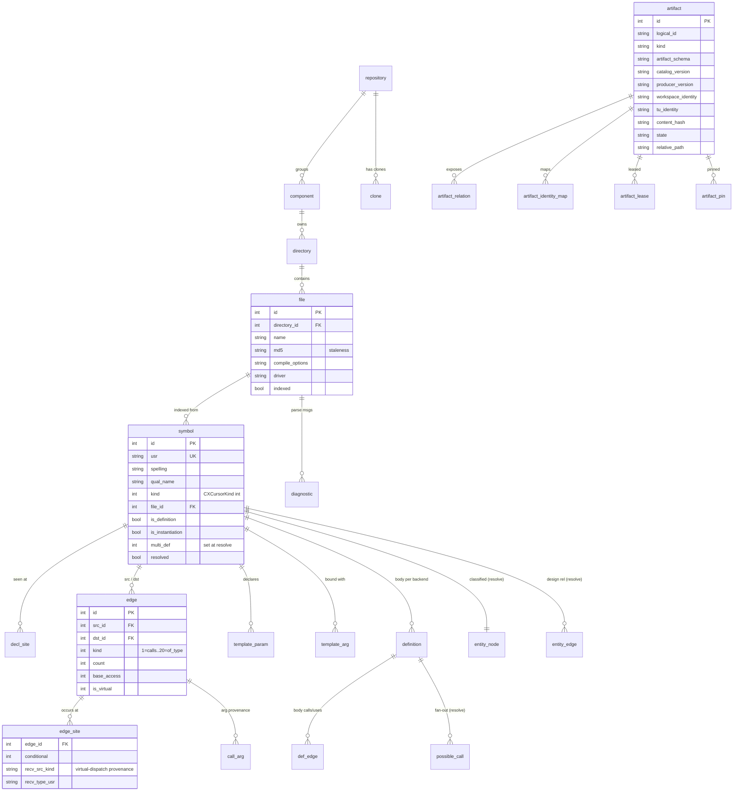

# Data Model (schema 35)

[← docs index](README.md)

The authoritative graph lives in one SQLite file, `index.db`. Optional
content-addressed sidecars are governed by manifest rows in that database;
they never become authoritative graph tables. Identity is the **USR**
(Unified Symbol Resolution string, e.g. `c:@N@geo@S@Circle@F@area#1`) — stable
across translation units and identical between the two indexing engines. The
schema and all migrations (`v2 → v28`) live in
[`storage/storage.cpp`](modules/storage.md); the row structs are
`storage/records.hpp`.

## Entity–relationship diagram

## Table reference

### Structural / ownership

| Table | Purpose |
|---|---|
| `meta` | key/value; holds `schema_version` (35) and `graph_resolved_at` |
| `repository`, `clone` | group components; track git clones / active clone |
| `component` | a source root (repo/dir): name, path, kind, version |
| `directory` | a directory under a component |
| `file` | one source/header: `md5` (staleness), `compile_options`, `driver`, `indexed` |
| `diagnostic` | parse warnings/errors kept per file |

### Optional artifact manifest

| Table | Purpose |
|---|---|
| `artifact` | manifest envelope, content hash, relative path, completeness/trust state, and current/stale/retired lifecycle |
| `artifact_relation` | deterministic list of relations exposed by a sidecar |
| `artifact_identity_map` | stable identity to sidecar-local identity mapping, including unresolved mappings |
| `artifact_lease` / `artifact_pin` | retention references that protect artifacts from recovery cleanup |

Sidecars are written, validated, durably renamed, and then published through a
core transaction. Attachments are read-only and require a complete, trusted,
hash-matching envelope. Missing, stale, corrupt, partial, or unknown artifacts
produce diagnostics rather than an empty complete result.

### Layer-0 — raw extraction (written by the indexing engine)

| Table | Purpose |
|---|---|
| `symbol` | one row per USR: spelling, qualified/display name, `kind` (raw `CXCursorKind` int), type, location + full extent, decl site, flags (`is_definition/pure/static/instantiation/named_instance`), `linkage`, `access`, `parent_usr`, `resolved` |
| `decl_site` | every physical `(file,line,col)` a symbol is seen at (all re-openings) |
| `symbol_kind`, `edge_kind` | id → name catalogs (display only) |
| `edge` | `src → dst` of a `kind` (see below); `count`, `base_access`, `is_virtual`, `vtable_slot` |
| `edge_site` | per-occurrence `(file,line,col)` of an edge + `conditional` + call-receiver provenance (`recv_src_kind/type_usr/decl_usr/param_pos/type_is_value`) |
| `call_arg` | per-argument value-source classification at a call site |
| `template_param` | template parameters of a template symbol |
| `template_arg` | concrete arguments of a specialization (`arg_kind`, `literal`, `ref_id`) |
| `definition` | a symbol's *body per backend/TU* (v27 multi-definition); location + `init_text` |
| `def_edge` | a definition's outgoing calls/uses (snapshot, survives cross-TU edge rewrites) |
| `label` | include-path alias tokens (`<label>`) for portable stored options |

### Layer-1 — design graph + roll-ups (written by `cidx resolve`)

| Table | Purpose |
|---|---|
| `entity_node` | each type symbol classified into a design kind (class / abstract_class / interface / union / enum + template variants) |
| `entity_edge` | derived entity relations (generalizes, implements, specializes, composes, aggregates, associates, creates, uses, destroys, befriends, instantiates, declares) |
| `possible_call` | body → body call fan-out for multiply-defined callees |
| `edge` kind 18 (`dispatch_calls`) | materialized virtual-dispatch caller edges (via the `overrides` closure) |

## Edge kinds

`edge.kind` is an integer (catalog seeded in `storage.cpp`):

| id | name | id | name |
|---|---|---|---|
| 1 | calls | 10 | construct-value |
| 2 | inherits | 11 | construct-temp |
| 3 | contains | 12 | construct-heap |
| 4 | specializes | 13 | construct-copy |
| 5 | instantiates | 14 | construct-move |
| 6 | overrides | 15 | factory-construct |
| 7 | uses | 16 | destroy |
| 8 | field_of | 17 | friend |
| 9 | method_of | 18 | dispatch_calls *(resolve)* |
| | | 19 | alias_of *(v34: typedef/using alias → its target; was `uses`)* |
| | | 20 | of_type *(v34: variable/field → its declared type; was `uses`)* |

## The three graph layers

1. **Layer-0** — what the AST literally contains (symbols + edges). Written by
   the [`ast`](modules/ast.md) engine; the contract is the normalized row
   set (see [record ordering](modules/ast.md#record-ordering)).
2. **Definition layer** — `definition` / `def_edge` capture per-body call/use
   sets so a symbol defined differently across TUs keeps each body's edges.
3. **Layer-1** — the *design* graph (`entity_node`/`entity_edge`) plus the
   `dispatch_calls` and `possible_call` roll-ups, derived from Layer-0 by a pure
   database transform at [`cidx resolve`](data-flow.md#the-resolve-pass).
