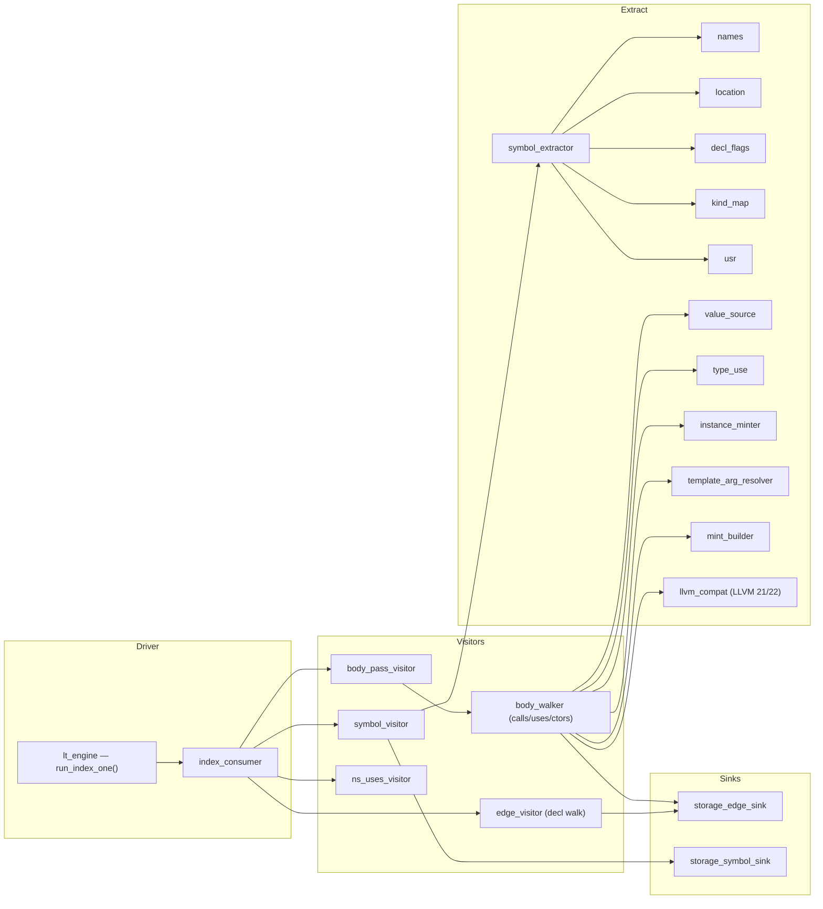

# `src/clangx_lt` — the LibTooling engine (`CIDX_INDEX_ENGINE=lt`)

[← docs index](../README.md) · related: [indexing engines](../indexing-engines.md) · [clangx](clangx.md)

An opt-in Layer-0 extraction engine built on the **Clang C++ API (LibTooling /
`RecursiveASTVisitor`)**. ~5.0k LOC across ~30 one-class-per-file modules. It
reproduces the [libclang engine](clangx.md) byte-for-byte at schema 28, and
unlocks the AST fidelity libclang can't expose (real template args, Concepts,
resolved dependent calls) for future work. Links the shared `clang-cpp` +
`libLLVM`.

## Component graph

## Roles

### Driver

- **`lt_engine` (`run_index_one`)** — the drop-in for `index_one`'s parse+index
  block: builds a `ClangTool` with the same flags/driver, records `#include`s
  via a `PPCallbacks`, collects diagnostics into `cidx::Diagnostic`, applies the
  same fatal-diagnostic gate (no rows on a fatal), and drives the interleaved
  pass sequence.
- **`index_consumer`** — an `ASTConsumer` running the pass order for the main
  file and its owned headers (see the
  [per-file interleave](../data-flow.md#the-per-file-interleave)).

### Visitors (one per pass)

| Class | Pass | Emits |
|---|---|---|
| `symbol_visitor` | symbols | `symbol` + `decl_site` (via the extractor) |
| `edge_visitor` | declaration edges | contains / inherits / field_of / method_of / overrides / friend / specializes / instantiates + `template_param`/`template_arg` + signature `uses` |
| `body_pass_visitor` + `body_walker` | body descent | calls (with dependent/overload recovery), uses, the 7 construct/destroy forms, receiver + `call_arg` provenance, cond-depth, `definition`/`def_edge` |
| `ns_uses_visitor` | namespace uses | qualifier / `using`-directive `uses` edges |

### Extraction helpers

`symbol_extractor` / `names` / `location` / `decl_flags` / `kind_map` / `usr`
reproduce libclang's spellings, extents, `CXCursorKind` integers, and USRs
exactly (`usr` uses `clang::index::generateUSRForDecl`, which yields the same
strings as `clang_getCursorUSR`). `value_source` / `type_use` / `instance_minter`
/ `template_arg_resolver` handle body-side classification and template
instances. **`llvm_compat`** localizes the LLVM 21↔22 API differences
(`NestedNameSpecifier` value-vs-pointer, `APSInt` formatting); the rest of the
divergences use `LLVM_VERSION_MAJOR` guards inline.

### Sinks

`EdgeSink` / `SymbolEmitter` are interfaces the visitors depend on — they never
touch storage directly. `storage_edge_sink` / `storage_symbol_sink` wrap
[`Storage`](storage.md) and are the **only** files here that include storage
headers (translating the layer's own record structs into `cidx::Symbol`/`Edge`/
…). `tsv_symbol_emitter` is a test/probe sink.

## Portability

The Clang C++ API is not source-stable across LLVM majors. Divergences are
confined to `llvm_compat.hpp` and a handful of `#if LLVM_VERSION_MAJOR >= 22`
guards (NestedNameSpecifier, `VisitTypeLoc` qualifier shim, `ElaboratedTypeLoc`
peeling, integral formatting). Verified byte-identical on LLVM 22 (macOS) and
LLVM 21 (RHEL 9.8). See [build](../build.md) for the link model (`-isystem`
headers, `-fno-rtti`, no `-static-libstdc++`).
