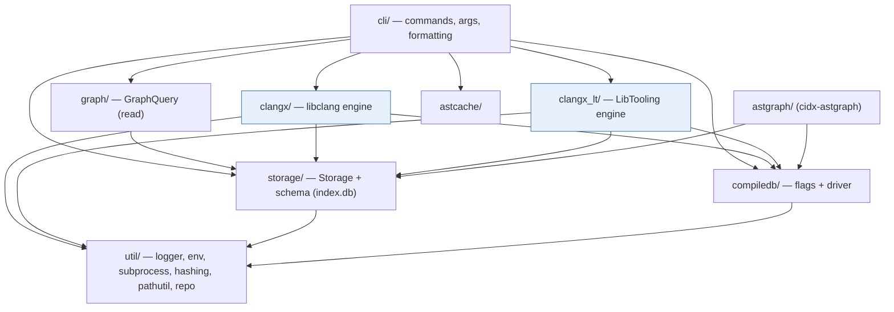

# Overview

[← docs index](README.md)

## What cidx does

cidx works in four stages, each a CLI subcommand backed by the shared
`index.db`:

| Stage | Command | Produces |
|---|---|---|
| **Import** | `cidx import <compile_commands.json>` | `component`/`directory`/`file` rows with per-file compile options |
| **Index** | `cidx index` | `symbol` + Layer-0 graph (`edge`, `edge_site`, `call_arg`, `template_*`, `definition`, `def_edge`) |
| **Resolve** | `cidx resolve` | Layer-1 (`entity_node`, `entity_edge`), materialized `dispatch_calls`, `possible_call`, roll-ups |
| **Query** | `cidx graph …`, `search`, `analyze`, `ast …` | navigation, impact analysis, Datalog results, on-demand AST |

See [data flow](data-flow.md) for how a translation unit moves through indexing
and resolution, and [data model](data-model.md) for what lands in the database.

## Design invariants

Two invariants shape the whole codebase and explain many otherwise-surprising
helpers:

- **Byte-for-byte parity** with the Python reference implementation under
  `python/indexer/`. Text/JSON output, USRs, hashes, and DB rows are identical
  between the two. This is why `util/pathutil` reimplements `os.path`,
  `cli/json_out` replicates `json.dumps(indent=2)`, etc.
- **Driver introspection.** The parser is always Clang (libclang or LibTooling),
  but the *include search paths* are replicated from whatever compiler `driver`
  the `compile_commands.json` names (e.g. a specific `g++`) by running
  `<driver> -E -x <lang> - -v`. This is what lets cidx index real GCC-built code
  correctly regardless of the parser. It lives in [`clangx/toolchain`](modules/clangx.md)
  and is shared by both engines.

## Module map (`src/`)

```
src/
├── main.cpp            entry point: parse args → build Context → run_command
├── cli/                command dispatch, arg parsing, output formatting   (~8.4k LOC)
├── storage/            the SQLite database layer                          (~5.5k LOC)
├── compiledb/          compile_commands.json load + sanitize + aliasing   (~0.6k LOC)
├── clangx/             libclang (C API) indexing engine  [default]        (~6.4k LOC)
├── clangx_lt/          Clang C++ API (LibTooling) indexing engine [opt-in] (~5.0k LOC)
├── graph/              read-only GraphQuery + emitters                    (~1.4k LOC)
├── astcache/           on-disk libclang TU cache for `cidx ast`          (~0.4k LOC)
├── astgraph/           `cidx-astgraph`: per-TU raw AST graph + Souffle    (~1.1k LOC)
└── util/               logger, env, subprocess, hashing, pathutil, repo … (~1.7k LOC)
```

Each has a dedicated page under [modules/](README.md#modules-src).

## Layering



Both engines depend only on `storage`, `compiledb`, and `util`; they are
mutually exclusive at runtime and produce **identical** rows. `graph` is
strictly read-only. See [indexing engines](indexing-engines.md).
