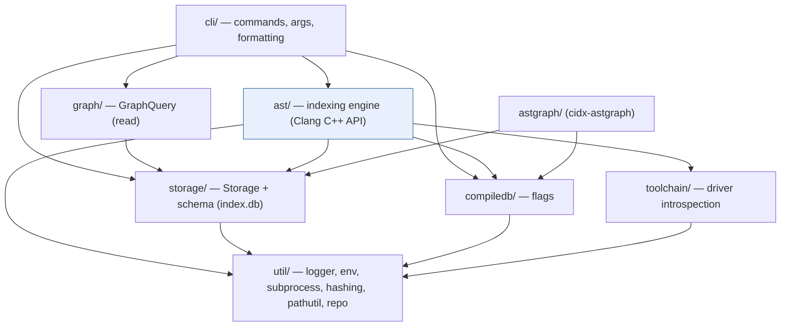

# Overview

[← docs index](README.md)

## What cidx does

cidx works in four stages, each a CLI subcommand backed by the shared
`index.db`:

| Stage | Command | Produces |
|---|---|---|
| **Import** | `cidx import <compile_commands.json>` | `component`/`directory`/`file` rows with per-file compile options |
| **Index** | `cidx index` | `symbol` + Layer-0 graph (`edge`, `edge_site`, `call_arg`, `template_*`, `definition`, `def_edge`) |
| **Resolve** | `cidx resolve` | Layer-1 (`entity_node`, `entity_edge`), materialized `dispatch_calls`, `possible_call`, roll-ups |
| **Query** | `cidx graph …`, `search`, `analyze` | navigation, impact analysis, Datalog results |

See [data flow](data-flow.md) for how a translation unit moves through indexing
and resolution, and [data model](data-model.md) for what lands in the database.

## Design invariants

- **Deterministic semantic output.** Text and JSON output is stable (field
  names, ordering, null handling, formatting do not drift). For the database,
  the contract is the NORMALIZED ROW SET, not insertion order: surrogate-key
  order follows AST traversal and is not public. The index golden gate
  (`tests/index_golden_test.cpp`) and `scripts/dump_layer0.sh` compare
  normalized, ordered projections of the seven Layer-0 tables.
- **Driver introspection.** The parser is always Clang, but the *include
  search paths* are replicated from whatever compiler `driver` the
  `compile_commands.json` names (e.g. a specific `g++`) by running
  `<driver> -E -x <lang> - -v`. This is what lets cidx index real GCC-built
  code correctly. It lives in [`toolchain/`](modules/toolchain.md).

## Module map (`src/`)

```
src/
├── main.cpp            entry point: parse args → build Context → run_command
├── cli/                command dispatch, arg parsing, output formatting
├── storage/            the SQLite database layer
├── compiledb/          compile_commands.json load + sanitize + aliasing
├── ast/                the indexing engine (Clang C++ API, RAV visitors)
├── toolchain/          driver introspection (include-path replication)
├── graph/              read-only GraphQuery + emitters
├── astgraph/           `cidx-astgraph`: per-TU raw AST graph + Souffle
└── util/               logger, env, subprocess, hashing, pathutil, repo …
```

Each has a dedicated page under [modules/](README.md#modules-src).

## Layering



The engine depends only on `storage`, `compiledb`, `toolchain`, and `util`.
`graph` is strictly read-only. See [ast](modules/ast.md).
